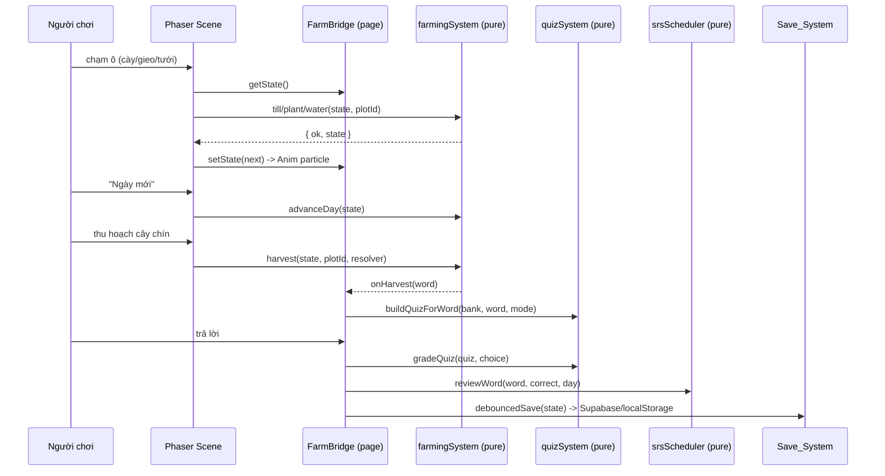
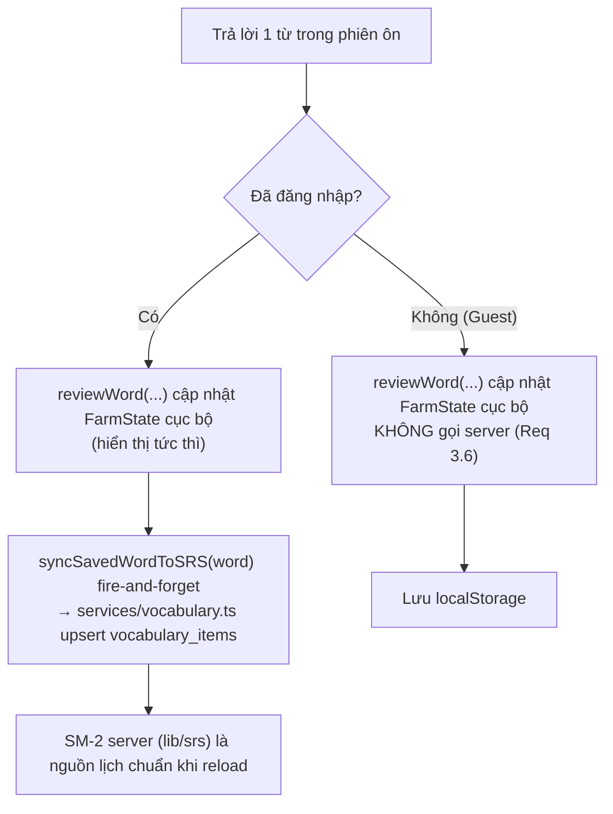
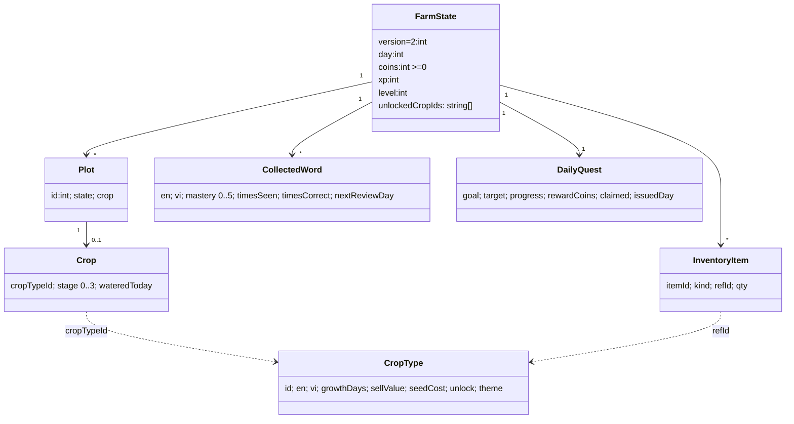

# Design Document — English Farm Upgrade

## Overview

Tài liệu này thiết kế kỹ thuật cho đợt **nâng cấp** game *English Farm*. Game hiện tại đã có sẵn một kiến trúc tốt: toàn bộ **logic thuần** (cày/gieo/tưới/lớn theo ngày/thu hoạch, quiz, từ vựng, tiến trình, save) nằm trong `src/game/farm/` dưới dạng TypeScript thuần — không import Phaser/React — và được kiểm thử bằng Vitest. Phaser scene (`createFarmScene.ts`) chỉ là lớp render + định tuyến input, còn React page (`english-farm/page.tsx`) sở hữu `FarmState` (nguồn sự thật) và làm cầu nối React ↔ Phaser.

Mục tiêu thiết kế là **mở rộng** kiến trúc đó, **không vẽ lại từ đầu**:

1. **Tái dùng tối đa** các pure system hiện có (`farmingSystem`, `quizSystem`, `vocabularySystem`, `progressionSystem`, `inventorySystem`, `farmSave`, `farmSceneView`) và mở rộng chúng theo hướng tương thích ngược.
2. **Thêm mới** các pure module: `srsScheduler` (lịch ôn trong game), `economySystem` (bán/mua/xu), `dailyQuest` (nhiệm vụ ngày); mở rộng `quizSystem` cho nhiều dạng (`meaning`/`listen`/`spelling`).
3. **Thêm mới** các lớp phụ thuộc trình duyệt (impure, không phải logic thuần): `pronunciation` (Web Speech API), `Cutscene_System` (phát `.mp4` offline), và mở rộng `Animation_System` trong Phaser scene.
4. **Tái dùng** hạ tầng SRS server đã có (`src/services/vocabulary.ts` + bảng `vocabulary_items` + `src/lib/srs.ts` SM-2) cho người chơi đã đăng nhập, và bản thuần cục bộ cho khách.
5. **Tái dùng** pattern asset offline đã có: `scripts/gen-veo-evolve.mjs` (Veo 3 image-to-video offline), `scripts/trim-farm-assets.mjs` (cắt PNG), và cơ chế fallback emoji/Icons8 trong scene.

Nguyên tắc xuyên suốt: **mọi quy tắc game (rule logic) phải nằm trong pure system để test bằng property-based testing**; Phaser/React/Web Speech/video chỉ là lớp trình bày và I/O, được thiết kế để **không bao giờ ném ngoại lệ** mà luôn fallback an toàn.

### Phân loại TÁI DÙNG vs THÊM MỚI (tổng quan)

| Thành phần | Trạng thái | Ghi chú |
|---|---|---|
| `types.ts`, `constants.ts` | **MỞ RỘNG** | Thêm field vào `CropType`, `FarmState`, `CollectedWord`; bump `SCHEMA_VERSION` |
| `data/crops.ts` | **MỞ RỘNG** | >6 loại cây + `unlock`, `theme` |
| `systems/farmingSystem.ts` | **TÁI DÙNG** | Giữ nguyên state machine + `advanceDay` |
| `systems/inventorySystem.ts` | **TÁI DÙNG** | Dùng `addItem`/`removeItem` cho economy |
| `systems/quizSystem.ts` | **MỞ RỘNG** | Thêm `Quiz_Mode`, `buildQuizForWord(mode)`, `gradeQuiz` chuẩn hóa spelling |
| `systems/vocabularySystem.ts` | **MỞ RỘNG** | Thêm field lịch ôn vào `CollectedWord`, `countMastered` |
| `systems/progressionSystem.ts` | **TÁI DÙNG + MỞ RỘNG** | Giữ `addXp`/`xpForLevel`; thêm unlock + daily quest |
| `save/farmSave.ts` | **MỞ RỘNG** | `deserialize` tương thích ngược (migrate v1→v2), sync Supabase |
| `scene/farmSceneView.ts` | **TÁI DÙNG** | Pure view-math giữ nguyên |
| `scene/createFarmScene.ts` | **MỞ RỘNG** | Animation_System nâng cấp |
| `systems/srsScheduler.ts` | **THÊM MỚI** | Pure lịch ôn giãn cách trong game |
| `systems/economySystem.ts` | **THÊM MỚI** | Pure bán/mua/xu |
| `systems/dailyQuest.ts` | **THÊM MỚI** | Pure daily quest |
| `lib/pronunciation.ts` | **THÊM MỚI** | Web Speech API + fallback |
| `scene/cutscene/*` | **THÊM MỚI** | Phát `.mp4` offline + fallback CSS |
| `services/vocabulary.ts`, `lib/srs.ts` | **TÁI DÙNG** | SM-2 server cho logged-in |
| `scripts/gen-veo-farm.mjs`, prompt template | **THÊM MỚI** (theo pattern `gen-veo-evolve.mjs`) | Tạo cutscene offline |

---

## Architecture

### Sơ đồ thành phần

```mermaid
graph TD
  subgraph React["React Page (english-farm/page.tsx) — sở hữu FarmState"]
    State["farmStateRef: FarmState<br/>(single source of truth)"]
    HUD["HUD / Overlays<br/>(Quiz, Inventory, Vocab, DailyQuest, Shop)"]
    Bridge["FarmBridge<br/>(getState/setState/onHarvest...)"]
  end

  subgraph Pure["Pure Systems (NO Phaser, NO React) — property-tested"]
    Farming["farmingSystem<br/>(till/plant/water/advanceDay/harvest)"]
    Quiz["quizSystem<br/>(buildQuizForWord/gradeQuiz)"]
    Vocab["vocabularySystem<br/>(collectWord/bumpMastery/countMastered)"]
    SRS["srsScheduler ⭐NEW<br/>(pickDueWords/reviewWord)"]
    Econ["economySystem ⭐NEW<br/>(sellCrop/buySeed)"]
    Prog["progressionSystem<br/>(addXp/xpForLevel/unlock)"]
    Quest["dailyQuest ⭐NEW<br/>(roll/track/claim)"]
    Inv["inventorySystem<br/>(addItem/removeItem)"]
    View["farmSceneView (pure view-math)"]
  end

  subgraph Phaser["Phaser Scene (createFarmScene.ts) — thin renderer"]
    Anim["Animation_System<br/>(sway/grow/sprout/sparkle/particles)"]
    Render["render plots + input routing"]
  end

  subgraph Browser["Browser I/O (impure, never throws)"]
    TTS["pronunciation ⭐NEW<br/>(Web Speech API + fallback)"]
    Cut["Cutscene_System ⭐NEW<br/>(<id>.mp4 offline + CSS fallback)"]
  end

  subgraph Persist["Save_System (save/farmSave.ts)"]
    Local["localStorage (guest)"]
    Supa["Supabase API (logged-in)"]
    SRSsrv["services/vocabulary.ts<br/>vocabulary_items + lib/srs (SM-2)"]
  end

  HUD --> State
  Bridge --> State
  State --> Pure
  Bridge --> Render
  Render --> Anim
  Render --> View
  HUD --> TTS
  HUD --> Cut
  State --> Persist
  Local -.guest.- Persist
  Supa -.logged-in.- Persist
  SRS -->|logged-in| SRSsrv
  SRS -->|guest| State
```



### Luồng vòng lặp gameplay (sequence)



### Nguyên tắc tách lớp

- **Pure core**: nhận `FarmState` (hoặc slice) → trả `FarmState` **mới**, không mutate, không ném lỗi (trả `{ ok, reason, state }`). Đây là nơi đặt mọi correctness property.
- **Phaser scene**: chỉ đọc `bridge.getState()`, gọi pure system, ghi `bridge.setState()`, và render. Mọi texture được bọc `loaderror` → fallback emoji.
- **React page**: sở hữu `farmStateRef` + mirror React state; mở overlay (quiz, shop, daily quest); debounce save.
- **Browser I/O** (TTS, cutscene): hàm bọc try/catch, phát hiện không hỗ trợ → degrade, không crash.
- **Persist**: logged-in → Supabase API + đồng bộ SRS server; guest → localStorage. Mọi nhánh lỗi → fallback localStorage / state mặc định.

---

## Components and Interfaces

### 1. Crop_Catalog (MỞ RỘNG `data/crops.ts`)

Mở rộng `CropType` với điều kiện mở khóa và theme (mùa). `getCropById` giữ nguyên; thêm helper lọc cây đã mở khóa.

```typescript
// types.ts — MỞ RỘNG
export type CropTheme = 'spring' | 'summer' | 'autumn' | 'winter'

/** Điều kiện mở khóa một loại cây (mọi field optional = luôn mở). */
export interface UnlockCondition {
  /** Cấp người chơi tối thiểu để mở khóa. */
  minLevel?: number
  /** Số xu tối thiểu để mua mở khóa (nếu cần). */
  minCoins?: number
}

export interface CropType {
  id: string
  en: string
  vi: string
  level: VocabLevel
  growthDays: number   // > 0
  sellValue: number    // > 0
  seedKey: string
  spriteKey: string
  // --- THÊM MỚI ---
  /** Giá mua 1 hạt ở shop (>= 0). */
  seedCost?: number
  /** Điều kiện mở khóa; vắng mặt = mở sẵn từ đầu. */
  unlock?: UnlockCondition
  /** Mùa/chủ đề để gom nhóm + trigger cutscene đổi mùa. */
  theme?: CropTheme
}
```

```typescript
// data/crops.ts — THÊM helper (tái dùng pattern CROP_BY_ID)
/** Cây được mở khóa theo cấp + xu hiện tại của người chơi. */
export function isCropUnlocked(crop: CropType, level: number, coins: number): boolean {
  const u = crop.unlock
  if (!u) return true
  if (u.minLevel != null && level < u.minLevel) return false
  if (u.minCoins != null && coins < u.minCoins) return false
  return true
}

export function getUnlockedCrops(level: number, coins: number): CropType[] {
  return CROPS.filter((c) => isCropUnlocked(c, level, coins))
}
```

Danh mục mở rộng (ví dụ, >6 loại) — giữ 6 loại cũ, thêm các loại có `unlock`/`theme`:

```typescript
// data/crops.ts — bổ sung vào mảng CROPS (giữ nguyên 6 loại beginner sẵn có)
{ id: 'eggplant',  en: 'Eggplant',  vi: 'Cà tím',    level: 'intermediate', growthDays: 5, sellValue: 22, seedKey: 'seed:eggplant',  spriteKey: 'eggplant',  seedCost: 12, unlock: { minLevel: 2 }, theme: 'summer' },
{ id: 'cabbage',   en: 'Cabbage',   vi: 'Bắp cải',   level: 'intermediate', growthDays: 4, sellValue: 18, seedKey: 'seed:cabbage',   spriteKey: 'cabbage',   seedCost: 10, unlock: { minLevel: 2 }, theme: 'autumn' },
{ id: 'watermelon',en: 'Watermelon',vi: 'Dưa hấu',   level: 'advanced',     growthDays: 6, sellValue: 30, seedKey: 'seed:watermelon',spriteKey: 'watermelon',seedCost: 18, unlock: { minLevel: 3 }, theme: 'summer' },
{ id: 'pineapple', en: 'Pineapple', vi: 'Dứa',       level: 'advanced',     growthDays: 6, sellValue: 28, seedKey: 'seed:pineapple', spriteKey: 'pineapple', seedCost: 16, unlock: { minLevel: 3 }, theme: 'summer' },
{ id: 'broccoli',  en: 'Broccoli',  vi: 'Súp lơ',    level: 'advanced',     growthDays: 5, sellValue: 24, seedKey: 'seed:broccoli',  spriteKey: 'broccoli',  seedCost: 14, unlock: { minLevel: 4 }, theme: 'winter' },
```

### 2. Quiz_System nhiều dạng (MỞ RỘNG `systems/quizSystem.ts`)

Giữ nguyên hành vi `meaning` hiện tại (đã đúng Property 3), thêm `Quiz_Mode` và chuẩn hóa chấm `spelling`. Tiếp tục tái dùng `buildDistractors`/`DEFAULT_WORD_BANK` từ `@/lib/word-bank` để luôn đủ 4 lựa chọn kể cả word bank rỗng.

```typescript
// quizSystem.ts — MỞ RỘNG
export type QuizMode = 'meaning' | 'listen' | 'spelling'

export interface FarmQuiz {
  mode: QuizMode
  /** Câu hỏi tiếng Việt (meaning) hoặc gợi ý (listen/spelling). */
  vi: string
  /** Đáp án tiếng Anh đúng. */
  en: string
  /**
   * Với meaning/listen: 4 lựa chọn duy nhất (luôn chứa `en`).
   * Với spelling: rỗng (người chơi gõ/ghép chữ).
   */
  choices: string[]
}

/**
 * Tạo quiz theo mode.
 * - meaning/listen: đúng 4 lựa chọn duy nhất (case-insensitive), luôn chứa `en`,
 *   top-up từ DEFAULT_WORD_BANK khi bank thiếu (giữ nguyên logic hiện tại).
 * - spelling: choices = [] (UI render ô nhập / ghép chữ cái).
 * `listen` dùng cùng cấu trúc 4 lựa chọn; lớp UI sẽ phát âm `en` thay vì hiện chữ.
 */
export function buildQuizForWord(
  bank: WordPair[] | null | undefined,
  answer: { en: string; vi: string },
  mode: QuizMode = 'meaning',
): FarmQuiz

/**
 * Chấm quiz. Chuẩn hóa cho spelling: bỏ qua hoa/thường + trim đầu/cuối.
 * Trả `correct=false` khi không xác định được (choice null/undefined/rỗng).
 */
export function gradeQuiz(
  quiz: FarmQuiz,
  choice: string | null | undefined,
): { correct: boolean; correctAnswer: string }
```

Pseudocode chuẩn hóa chấm điểm (Req 2.4, 2.6):

```
function gradeQuiz(quiz, choice):
  correctAnswer = quiz.en
  if choice == null: return { correct: false, correctAnswer }   # Req 2.6
  if quiz.mode == 'spelling':
     norm(s) = s.trim().toLowerCase()
     return { correct: norm(choice) == norm(quiz.en), correctAnswer }
  else:  # meaning/listen — so khớp lựa chọn (case-insensitive để an toàn)
     return { correct: choice.trim().toLowerCase() == quiz.en.toLowerCase(), correctAnswer }
```

`buildQuizForWord` giữ bất biến: dùng `Set` case-insensitive để dedupe, ưu tiên distractor từ `bank` rồi `DEFAULT_WORD_BANK`; nếu `mode != 'spelling'` luôn trả `choices.length === 4` và chứa `en`.

### 3. SRS_Scheduler trong game (THÊM MỚI `systems/srsScheduler.ts`)

Pure module lập lịch ôn giãn cách dựa trên "ngày game" (`FarmState.day`). Đây là logic thuần để test; nhánh đồng bộ server là impure ở lớp page.

```typescript
// srsScheduler.ts — THÊM MỚI (pure)
import type { CollectedWord } from '../types'

/** Khoảng cách (ngày game) cho từng bậc mastery khi trả lời ĐÚNG. */
export const SRS_INTERVALS = [1, 2, 4, 7, 15, 30] as const // index theo mastery 0..5

/** Chọn các từ đến hạn ôn, ưu tiên mastery thấp trước. */
export function pickDueWords(
  words: CollectedWord[],
  currentDay: number,
  limit: number,
): CollectedWord[]

/** Cập nhật lịch ôn của 1 từ sau khi trả lời. Trả mảng MỚI. */
export function reviewWord(
  words: CollectedWord[],
  en: string,
  correct: boolean,
  currentDay: number,
): CollectedWord[]
```

Pseudocode `pickDueWords` (Req 3.2, 3.7) — model-based, có nhánh "không có từ đến hạn":

```
function pickDueWords(words, currentDay, limit):
  due = words.filter(w => w.nextReviewDay <= currentDay)
  if due.isEmpty():
     # Req 3.7: không để phiên rỗng → lấy từ sắp đến hạn (gần currentDay nhất)
     upcoming = words.sortedBy(w => w.nextReviewDay)
     return upcoming.take(limit)
  due.sortBy(w => [w.mastery, w.nextReviewDay])   # mastery thấp trước, rồi đến hạn sớm
  return due.take(limit)
```

Pseudocode `reviewWord` (Req 3.3, đơn điệu interval) — tái dùng tinh thần SM-2:

```
function reviewWord(words, en, correct, currentDay):
  return words.map(w =>
    sameWord(w.en, en) ? applyReview(w) : w)

function applyReview(w):
  timesSeen' = w.timesSeen + 1
  timesCorrect' = w.timesCorrect + (correct ? 1 : 0)
  if correct:
     mastery' = clamp(w.mastery + 1, 0, 5)
     interval = SRS_INTERVALS[mastery']        # interval KHÔNG giảm khi đúng
  else:
     mastery' = clamp(w.mastery - 1, 0, 5)
     interval = SRS_INTERVALS[0]               # reset về gần nhất (=1)
  nextReviewDay' = currentDay + interval
  return { ...w, timesSeen', timesCorrect', mastery', nextReviewDay' }
```

**Nhánh logged-in vs guest** (impure, ở `page.tsx` / save layer):



Lưu ý đồng bộ: `services/vocabulary.ts` đã có `syncSavedWordToSRS` (fire-and-forget, no-op cho guest) và `submitReview`/`getWordsForReview`. Khi logged-in, page gọi `syncSavedWordToSRS({ word: en, meaningVi: vi })` để upsert vào `vocabulary_items` (idempotent theo `(user_profile_id, word_lower)`), tránh tạo trùng hoặc reset lịch. `FarmState.collectedWords` vẫn giữ lịch cục bộ để render "từ đã thuộc" tức thì mà không chặn vòng game.

### 4. Pronunciation_System (THÊM MỚI `lib/pronunciation.ts`)

Bọc Web Speech API; phát hiện hỗ trợ một lần, chọn giọng `en`, fallback an toàn (Req 1.2, 1.4, 1.5).

```typescript
// lib/pronunciation.ts — THÊM MỚI (impure, never throws)
/** True nếu trình duyệt hỗ trợ TTS (kiểm tra ngay, dùng disable nút). */
export function isSpeechSupported(): boolean

/**
 * Phát âm `text` bằng giọng tiếng Anh nếu có.
 * - Chọn voice có lang bắt đầu 'en' (en-US/en-GB...) từ getVoices().
 * - Nếu không hỗ trợ hoặc lỗi: no-op, trả false (UI giữ chữ + disable nút).
 */
export function speak(text: string, opts?: { rate?: number; lang?: string }): boolean
```

Pseudocode chọn giọng (Req 1.5):

```
function pickEnglishVoice():
  voices = speechSynthesis.getVoices()       # có thể rỗng lần đầu → lắng nghe 'voiceschanged'
  return voices.find(v => v.lang.toLowerCase().startsWith('en')) ?? voices[0] ?? null
```

UI (React): nút loa cạnh từ; `disabled = !isSpeechSupported()`. Gọi `speak(en)` khi chọn hạt (Req 1.2), khi chạm cây trồng (Req 1.3), và ở `listen` quiz.

### 5. Animation_System (MỞ RỘNG `scene/createFarmScene.ts`)

Tái dùng các tween/particle đã có (đung đưa cây, sparkle khi chín, pop khi gieo, idle nông dân) và bổ sung:

| Hiệu ứng | Req | Cách làm (tái dùng Phaser tween/emitter sẵn có) |
|---|---|---|
| Đung đưa theo gió | 6.1 | `startCropIdle` đã có; áp cho mọi cây `planted` (sway angle yoyo) |
| Lớn mượt (interpolate) | 6.2 | Khi stage tăng: tween `scale` cũ→mới ease `Back.easeOut` thay vì set tức thì |
| Nảy mầm | 6.3 | `renderPlot(plotId, { pop: true })` đã có khi gieo |
| Lấp lánh khi chín | 6.4 | `sparkleTimers` + `emitSparkle` đã có cho cây mature |
| Particle cày/tưới | 6.5 | Emitter `PARTICLE_DOT`; cày→hạt nâu, tưới→giọt xanh; **cày ưu tiên** khi trùng |
| Phản hồi quiz đúng/sai | 6.6 | Flash overlay xanh (đúng) / rung đỏ (sai) ở lớp page/scene |
| Giới hạn mobile | 6.7 | `MAX_CONCURRENT_PARTICLES`; `quantity`/`lifespan` giảm khi `isMobile` |

```typescript
// constants.ts — THÊM
export const MAX_CONCURRENT_PARTICLES = 24       // desktop
export const MAX_CONCURRENT_PARTICLES_MOBILE = 10
```

Quy tắc ưu tiên cày khi cày+tưới cùng lúc (Req 6.5) là pure, đặt trong helper view để test:

```typescript
// farmSceneView.ts — THÊM (pure)
export type ParticleKind = 'soil' | 'water'
/** Khi cả cày và tưới xảy ra, ưu tiên 'soil'. */
export function resolveParticleKind(tilled: boolean, watered: boolean): ParticleKind | null {
  if (tilled) return 'soil'
  if (watered) return 'water'
  return null
}
```

### 6. Cutscene_System (THÊM MỚI `scene/cutscene/`)

Phát video offline đã tạo sẵn; **không** gọi Veo/Gemini lúc chạy (Req 7.2). Cột mốc → id cutscene; thiếu video → fallback CSS/particle; luôn cho game tiếp tục (Req 7.3); có nút skip (Req 7.4).

```typescript
// scene/cutscene/cutsceneTrigger.ts — THÊM MỚI (pure, testable)
export type CutsceneId = 'big-harvest' | 'level-up' | 'season-change'

export interface CutsceneEvent {
  /** stage cũ/mới + số nông sản vừa thu + theme mùa cũ/mới. */
  prevLevel: number; nextLevel: number
  harvestQty: number
  prevTheme?: CropTheme; nextTheme?: CropTheme
}

/** Quyết định cột mốc nào (nếu có) cần phát, theo thứ tự ưu tiên. */
export function resolveCutscene(e: CutsceneEvent): CutsceneId | null
```

```
function resolveCutscene(e):
  if e.nextLevel > e.prevLevel: return 'level-up'
  if e.nextTheme && e.nextTheme != e.prevTheme: return 'season-change'
  if e.harvestQty >= BIG_HARVEST_THRESHOLD: return 'big-harvest'
  return null
```

```typescript
// scene/cutscene/CutscenePlayer.tsx — THÊM MỚI (React overlay, never throws)
// 1. <video src="/games/english-farm/cutscenes/<id>.mp4" autoPlay playsInline />
// 2. onError / video thiếu → render fallback CSS/particle (confetti div)
// 3. luôn có nút "Bỏ qua" (skip) → onComplete()
// 4. nếu cả fallback lỗi → onComplete() ngay (game không kẹt)
```

Đường dẫn cố định, song song với pet game (`public/games/pet/evolve/<id>.mp4`):
`public/games/english-farm/cutscenes/big-harvest.mp4 | level-up.mp4 | season-change.mp4`.

### 7. Economy_System (THÊM MỚI `systems/economySystem.ts`)

Pure, tái dùng `inventorySystem.addItem/removeItem`. Giữ `coins >= 0` (Req 8.1, 8.2); bán theo `sellValue` (Req 4.8).

```typescript
// economySystem.ts — THÊM MỚI (pure)
import type { FarmState, Result } from '../types'

/** Bán 1 nông sản 'crop:<cropId>': coins += sellValue, qty -= 1. */
export function sellCrop(state: FarmState, cropId: string): Result

/** Mua 1 hạt 'seed:<cropId>': cần đủ xu + cây đã mở khóa. */
export function buySeed(state: FarmState, cropId: string): Result
```

```
function sellCrop(state, cropId):
  item = inventory['crop:'+cropId]
  if !item or item.qty <= 0: return { ok:false, reason:'Không có nông sản', state }   # Req 9 (3,9)
  crop = getCropById(cropId)
  if !crop: return { ok:false, reason:'Cây không hợp lệ', state }
  next = clone(state)
  removeItem(next.inventory, 'crop:'+cropId, 1)
  next.coins = state.coins + crop.sellValue            # luôn >= 0
  return { ok:true, state: next }

function buySeed(state, cropId):
  crop = getCropById(cropId)
  if !crop or !isCropUnlocked(crop, state.level, state.coins): return { ok:false, reason:'Chưa mở khóa', state }
  cost = crop.seedCost ?? defaultCost
  if state.coins < cost: return { ok:false, reason:'Không đủ xu', state }   # Req 8.2 giữ nguyên
  next = clone(state); next.coins -= cost              # >= 0 do guard ở trên
  addItem(next.inventory, { kind:'seed', refId:cropId, qty:1 })
  return { ok:true, state: next }
```

### 8. Progression_System (MỞ RỘNG `systems/progressionSystem.ts`) + Daily Quest

Giữ nguyên `addXp`/`xpForLevel` (đã hỗ trợ nhảy nhiều cấp — Req 8.3). Thêm tính danh sách mở khóa và daily quest.

```typescript
// progressionSystem.ts — TÁI DÙNG addXp/xpForLevel; THÊM:
/** Các cropId vừa được mở khóa khi lên cấp (để báo + bật cutscene). */
export function newlyUnlockedCrops(prevLevel: number, nextLevel: number, coins: number): string[]
```

```typescript
// dailyQuest.ts — THÊM MỚI (pure)
export type QuestGoal = 'harvest' | 'review' | 'sell'
export interface DailyQuest {
  goal: QuestGoal
  target: number          // ví dụ 3 (thu hoạch 3 cây)
  progress: number
  rewardCoins: number
  claimed: boolean
  /** Ngày game khi quest được phát (để reset theo ngày). */
  issuedDay: number
}

/** Phát quest mới cho ngày (deterministic theo seed = day). */
export function rollDailyQuest(day: number): DailyQuest
/** Tăng tiến độ theo sự kiện; clamp tại target. */
export function trackQuest(q: DailyQuest, goal: QuestGoal, amount: number): DailyQuest
/** Nhận thưởng khi progress >= target và chưa claim; trả coins cộng thêm. */
export function claimQuest(q: DailyQuest): { quest: DailyQuest; rewardCoins: number }
```

### 9. Save_System (MỞ RỘNG `save/farmSave.ts`)

Giữ kiến trúc PURE (`createInitialFarmState`/`serializeFarm`/`deserializeFarm`) + IMPURE (`loadFarm`/`saveFarm`) không bao giờ ném lỗi. Bump `SCHEMA_VERSION` và **migrate tương thích ngược** v1→v2.

```typescript
// constants.ts
export const SCHEMA_VERSION = 2   // từ 1 -> 2 (thêm field SRS/economy/quest)
```

```
function deserializeFarm(raw):
  try:
    parsed = (typeof raw == 'string') ? JSON.parse(raw) : raw
    if parsed == null or empty: return createInitialFarmState()
    if parsed.version == 2 and isValidV2(parsed): return parsed
    if parsed.version == 1 and isValidV1(parsed): return migrateV1toV2(parsed)   # tương thích ngược
    return createInitialFarmState()        # Req 9.2: sai schema → mặc định an toàn
  catch: return createInitialFarmState()

function migrateV1toV2(s):
  return { ...s, version: 2,
    collectedWords: s.collectedWords.map(w => ({
       timesCorrect: 0, nextReviewDay: s.day, ...w })),   # bổ sung field mới với default
    dailyQuest: rollDailyQuest(s.day),
    unlockedCropIds: getUnlockedCrops(s.level, s.coins).map(c => c.id) }
```

Đồng bộ Supabase (Req 8.6, 9.3) giữ nguyên: logged-in → `PUT /api/games/farm/save { payload }`, lỗi → fallback `localStorage`; guest → luôn `localStorage` (Req 8.7).

---

## Data Models

### FarmState mở rộng (v2)

```typescript
// types.ts — MỞ RỘNG CollectedWord
export interface CollectedWord {
  en: string
  vi: string
  level: VocabLevel
  timesSeen: number
  mastery: number              // 0..5; "đã thuộc" khi >= 4 (Req 3.4)
  firstCollectedAt: string
  // --- THÊM MỚI (lịch ôn cục bộ — Req 3.1) ---
  timesCorrect: number         // số lần trả lời đúng
  nextReviewDay: number        // ngày game ôn kế tiếp
}

// types.ts — MỞ RỘNG FarmState
export interface FarmState {
  version: number              // = 2
  day: number
  coins: number                // luôn >= 0 (Req 8.1)
  xp: number
  level: number
  grid: { cols: number; rows: number; plots: Plot[] }
  inventory: { slotLimit: number; items: InventoryItem[] }
  collectedWords: CollectedWord[]
  // --- THÊM MỚI ---
  unlockedCropIds: string[]    // nội dung đã mở khóa (Req 8.4)
  dailyQuest: DailyQuest       // nhiệm vụ ngày hiện tại (Req 8.5)
  updatedAt: string
}
```

`Crop`, `Plot`, `InventoryItem`, `GrowthStage`, `PlotState`, `VocabLevel`, `Result`, `HarvestResult`: **giữ nguyên**.

### Sơ đồ quan hệ dữ liệu



### Thay đổi schema save (tóm tắt)

- `SCHEMA_VERSION: 1 → 2`.
- Thêm `FarmState.unlockedCropIds`, `FarmState.dailyQuest`.
- Thêm `CollectedWord.timesCorrect`, `CollectedWord.nextReviewDay`.
- `deserializeFarm`: nhận v2 trực tiếp, **migrate v1→v2** (điền default), mọi trường hợp khác → `createInitialFarmState()`. Round-trip `deserialize(serialize(state)) ≡ state` cho v2.


---

## Correctness Properties

*Một property (thuộc tính) là đặc điểm/hành vi phải luôn đúng trên mọi lần thực thi hợp lệ của hệ thống — một phát biểu hình thức về điều phần mềm phải làm. Property là cầu nối giữa đặc tả con người đọc được và đảm bảo đúng đắn máy kiểm chứng được.*

Các property dưới đây áp dụng cho **logic thuần** (pure TypeScript, không Phaser/React/Web Speech/video) và sẽ được kiểm thử bằng property-based testing với Vitest. Phần thuộc trình duyệt/đồ họa/server (TTS, animation, cutscene playback, đồng bộ Supabase, cảm ứng) được kiểm bằng unit/integration/smoke test (xem Testing Strategy), không phải PBT.

Sau bước prework + property reflection, các tiêu chí trùng nhau đã được gộp; tập property cuối cùng dưới đây bao phủ trọn 9 correctness property đã nêu trong requirements, cộng vài property thuần độc lập (đếm từ thuộc, ưu tiên particle, chọn cutscene, daily quest, lên cấp nhảy bậc, không-ném-lỗi).

### Property 1: Xu không âm qua mọi giao dịch

*For any* trạng thái khởi đầu hợp lệ và *for any* chuỗi giao dịch hợp lệ bất kỳ (bán nông sản, mua hạt, cộng XP/thưởng), sau mỗi bước `state.coins >= 0` luôn đúng.

**Validates: Requirements 8.1, 8.2**

### Property 2: Tiến trình cây theo ngày

*For any* `FarmState` với lưới cây bất kỳ, sau `advanceDay`: mỗi cây `planted` được tưới có `stage' = min(stage + 1, GROWTH_STAGE_MAX)`; cây không tưới giữ nguyên `stage`; `wateredToday` của **mọi** cây trở về `false`; và `stage` luôn nằm trong `0..GROWTH_STAGE_MAX`.

**Validates: Requirements 4.4, 4.5**

### Property 3: Quiz luôn hợp lệ

*For any* từ đích `{en, vi}`, *for any* word bank (kể cả rỗng/null) và *for any* `Quiz_Mode` thuộc {`meaning`, `listen`}, `buildQuizForWord` trả về đúng 4 lựa chọn duy nhất (so sánh không phân biệt hoa/thường) luôn chứa đáp án đúng `en`; với mode `spelling` thì `choices` rỗng và `en` là đáp án đích. Quiz luôn mang đúng `mode` được yêu cầu.

**Validates: Requirements 2.1, 2.2, 2.3, 2.8**

### Property 4: Chấm quiz chuẩn hóa và an toàn

*For any* quiz và *for any* câu trả lời: với mode `spelling`, `gradeQuiz` trả `correct = true` khi và chỉ khi câu trả lời khớp `en` sau khi bỏ qua hoa/thường và khoảng trắng đầu/cuối; với `meaning`/`listen`, `correct = true` khi và chỉ khi lựa chọn khớp `en`; nếu câu trả lời không xác định được (null/undefined/rỗng) thì `correct = false`. Trong mọi trường hợp `correctAnswer === quiz.en`.

**Validates: Requirements 2.4, 2.5, 2.6, 2.7**

### Property 5: Lập lịch SRS đơn điệu

*For any* từ đã thu thập và *for any* kết quả trả lời: trả lời **đúng** làm khoảng cách tới ngày ôn kế tiếp **không nhỏ hơn** mức trước (interval không giảm) và tăng `timesCorrect`; trả lời **sai** đặt lại interval về mức nhỏ nhất; `timesSeen` luôn tăng đúng 1; và `mastery` luôn nằm trong `0..5`.

**Validates: Requirements 3.1, 3.3**

### Property 6: Chọn từ ôn ưu tiên đến hạn

*For any* danh sách từ đã thu thập và *for any* ngày hiện tại, khi tồn tại từ đến hạn (`nextReviewDay <= currentDay`), `pickDueWords` chỉ chọn các từ đến hạn và sắp xếp mastery thấp trước (khớp một mô hình tham chiếu lọc-rồi-sắp-xếp); khi không có từ nào đến hạn nhưng danh sách không rỗng, kết quả vẫn **không rỗng** (lấy từ sắp đến hạn).

**Validates: Requirements 3.2, 3.7**

### Property 7: Round-trip lưu/khôi phục

*For any* `FarmState` v2 hợp lệ, `deserializeFarm(serializeFarm(state))` cho ra một `FarmState` tương đương về mặt dữ liệu với `state` ban đầu.

**Validates: Requirements 9.1**

### Property 8: Khôi phục an toàn khi dữ liệu hỏng

*For any* dữ liệu lưu đầu vào bất kỳ (chuỗi rác, JSON sai cú pháp, object thiếu field, sai `version`, null), `deserializeFarm` trả về một `FarmState` hợp lệ (mặc định an toàn hoặc bản đã migrate) **mà không ném lỗi**.

**Validates: Requirements 9.2**

### Property 9: Bán nông sản nhất quán

*For any* `FarmState` và *for any* `cropId`: khi kho có nông sản đó, `sellCrop` làm số lượng loại đó giảm đúng 1 và `coins` tăng đúng `sellValue`; khi không có nông sản đó, thao tác bị từ chối (`ok: false`) và giữ nguyên trạng thái.

**Validates: Requirements 4.8**

### Property 10: Đếm từ đã thuộc

*For any* danh sách từ đã thu thập, `countMastered` trả về đúng số phần tử có `mastery >= 4`.

**Validates: Requirements 3.4**

### Property 11: Mở khóa theo điều kiện

*For any* `CropType` có điều kiện mở khóa và *for any* cấp/xu người chơi, `isCropUnlocked` trả `true` khi và chỉ khi thỏa mọi điều kiện (`minLevel`, `minCoins`); cây không có điều kiện luôn mở.

**Validates: Requirements 5.2, 8.4**

### Property 12: Lên cấp nhảy bậc đúng

*For any* `FarmState` và *for any* lượng XP cộng thêm (kể cả rất lớn), sau `addXp` cấp độ tăng đúng số bậc mà tổng XP cho phép, XP dư luôn nhỏ hơn ngưỡng của cấp kế tiếp, và cấp không bao giờ nhỏ hơn 1.

**Validates: Requirements 8.3**

### Property 13: Daily quest đo được và thưởng đúng một lần

*For any* daily quest và *for any* chuỗi sự kiện tiến độ, `trackQuest` giữ `progress` trong `0..target` (clamp tại target); `claimQuest` chỉ trao thưởng (`rewardCoins > 0`) khi `progress >= target` và chưa từng claim, và sau khi claim thì lần claim tiếp theo không trao thêm thưởng.

**Validates: Requirements 8.5**

### Property 14: Ưu tiên particle cày khi trùng

*For any* tổ hợp cờ (cày, tưới), `resolveParticleKind` trả `'soil'` khi có cày (kể cả khi đồng thời tưới), trả `'water'` khi chỉ tưới, và `null` khi không có thao tác nào.

**Validates: Requirements 6.5**

### Property 15: Chọn cutscene theo cột mốc

*For any* `CutsceneEvent`, `resolveCutscene` trả đúng cột mốc theo thứ tự ưu tiên (lên cấp → đổi mùa → thu hoạch lớn) và trả `null` khi không đạt cột mốc nào.

**Validates: Requirements 7.1**

### Property 16: Farm_System không ném lỗi

*For any* `FarmState` và *for any* thao tác nông trại với tham số bất kỳ (kể cả `plotId` không hợp lệ, gieo khi hết hạt, thu hoạch ô trống, kho đầy), các hàm `till`/`plant`/`water`/`harvest` **không ném ngoại lệ**; khi trả `ok: false`, trạng thái được giữ nguyên (tham chiếu state đầu vào).

**Validates: Requirements 4.3, 4.7, 9.5**

---

## Error Handling

Triết lý: **không ném lỗi ra vòng game**. Mọi lớp đều có chiến lược fallback xác định.

| Lớp | Tình huống lỗi | Xử lý |
|---|---|---|
| Pure systems | Thao tác không hợp lệ | Trả `{ ok: false, reason, state }`, giữ nguyên state (Req 9.5, Property 16) |
| `farmSave.deserialize` | JSON hỏng / sai version / thiếu field | `createInitialFarmState()` hoặc migrate v1→v2; không throw (Req 9.2, Property 8) |
| `loadFarm`/`saveFarm` | Mạng/timeout/quyền Supabase | logged-in lỗi → fallback `localStorage`; guest → luôn `localStorage`; bọc try/catch (Req 9.3, 8.7) |
| `pronunciation.speak` | Không hỗ trợ TTS / lỗi voice | Trả `false`, UI disable nút + hiện chữ; phát hiện ngay bằng `isSpeechSupported()` (Req 1.4) |
| Phaser texture | Asset sprite thiếu | `loaderror` → fallback iso art → emoji; không vỡ render (Req 5.3, 9.4) |
| Cutscene | Video thiếu/không phát được | Fallback CSS/particle; nếu fallback cũng lỗi → `onComplete()` ngay (Req 7.3) |
| Quiz | Word bank rỗng | Top-up `DEFAULT_WORD_BANK`, luôn đủ 4 lựa chọn (Req 2.8, Property 3) |
| SRS | Không có từ đến hạn | `pickDueWords` trả từ sắp đến hạn, không để phiên rỗng (Req 3.7, Property 6) |
| Server SRS sync | `syncSavedWordToSRS` lỗi | Fire-and-forget, `.catch` nuốt lỗi; no-op cho guest (Req 3.5, 3.6) |

### Mobile

- Render full-screen Phaser canvas với `Scale.RESIZE` + `CENTER_BOTH` (đã có).
- Định tuyến input qua `pointerdown` (đã có) — hỗ trợ chạm (Req 9.6).
- `Animation_System` giới hạn particle đồng thời theo `MAX_CONCURRENT_PARTICLES_MOBILE`, giảm `lifespan`/`quantity` khi phát hiện mobile (Req 6.7).
- Cutscene `<video playsInline>` để tránh fullscreen ép buộc trên iOS; nút skip lớn, vùng chạm rộng.

---

## Testing Strategy

### Cách tiếp cận kép

- **Unit/Example test**: ví dụ cụ thể, biên, lỗi, và dữ liệu tĩnh (catalog).
- **Property test (PBT)**: bất biến phổ quát trên nhiều input ngẫu nhiên — cho 16 property ở trên.
- **Integration/Smoke test**: lớp trình duyệt/server (TTS, animation, cutscene playback, Supabase sync, mobile pointer) — số ví dụ ít (1–3), dùng mock.

### Thư viện và cấu hình PBT

- **Tái dùng** stack test sẵn có: **Vitest** (dự án đã dùng cho mọi pure system).
- Dùng thư viện PBT cho TypeScript: **`fast-check`** (không tự viết PBT từ đầu).
- Mỗi property test chạy **tối thiểu 100 iteration** (`fc.assert(fc.property(...), { numRuns: 100 })`).
- Mỗi test gắn comment tham chiếu property của design, định dạng:
  `// Feature: english-farm-upgrade, Property {n}: {tên property}`

### Ánh xạ property → file test (PBT)

| Property | Module test | Generator chính |
|---|---|---|
| 1 — coins >= 0 | `economySystem.pbt.test.ts` | chuỗi giao dịch ngẫu nhiên (sell/buy/addXp) |
| 2 — advanceDay | `farmingSystem.pbt.test.ts` | grid cây + cờ watered ngẫu nhiên |
| 3 — quiz hợp lệ | `quizSystem.pbt.test.ts` | từ + bank (kể cả rỗng) + mode |
| 4 — chấm chuẩn hóa | `quizSystem.pbt.test.ts` | từ đích + biến thể case/space + choice null |
| 5 — SRS đơn điệu | `srsScheduler.pbt.test.ts` | từ + chuỗi đúng/sai |
| 6 — chọn từ ôn | `srsScheduler.pbt.test.ts` | danh sách CollectedWord + currentDay |
| 7 — round-trip save | `farmSave.pbt.test.ts` | FarmState v2 hợp lệ ngẫu nhiên |
| 8 — khôi phục an toàn | `farmSave.pbt.test.ts` | raw rác (string/number/object thiếu field) |
| 9 — bán nông sản | `economySystem.pbt.test.ts` | state có/không có crop |
| 10 — đếm từ thuộc | `vocabularySystem.pbt.test.ts` | danh sách mastery ngẫu nhiên |
| 11 — mở khóa | `crops.pbt.test.ts` | crop unlock + level/coins |
| 12 — lên cấp nhảy bậc | `progressionSystem.pbt.test.ts` | xp/level + amount lớn |
| 13 — daily quest | `dailyQuest.pbt.test.ts` | quest + chuỗi track |
| 14 — particle cày | `farmSceneView.pbt.test.ts` | cờ (tilled, watered) |
| 15 — chọn cutscene | `cutsceneTrigger.pbt.test.ts` | CutsceneEvent ngẫu nhiên |
| 16 — không ném lỗi | `farmingSystem.pbt.test.ts` | thao tác + plotId bất kỳ |

### Unit/Example test (không PBT)

- Catalog tĩnh: `CROPS.length > 6`, mọi field hợp lệ, `id` duy nhất, `spriteKey === id` (Req 1.1, 5.1, 5.4).
- `pickEnglishVoice` chọn `en-*` từ danh sách voices giả lập (Req 1.5).
- Edge cases đã có test sẵn cho `plant`/`harvest` (hết hạt, kho đầy) — **giữ nguyên** (Req 4.3, 4.7).

### Integration/Smoke test (mock)

- TTS (Req 1.2, 1.4): mock `window.speechSynthesis`; xác nhận `speak` gọi đúng từ và trả `false` khi không hỗ trợ.
- SRS server (Req 3.5, 3.6): mock `syncSavedWordToSRS`; gọi khi logged-in, **không** gọi khi guest.
- Save sync (Req 8.6, 8.7, 9.3): mock `fetch`/`localStorage`; PUT khi logged-in, fallback localStorage khi lỗi, guest luôn localStorage.
- Cutscene (Req 7.2, 7.3, 7.4): xác nhận chỉ dùng `<video src=local>` (không import `@google/genai`), `onError` → fallback, skip → `onComplete`.
- Asset fallback (Req 5.3, 9.4): mô phỏng `loaderror` → emoji.
- Animation & mobile (Req 6.1–6.4, 6.6, 6.7, 9.6): kiểm thủ công + smoke; xác nhận giới hạn particle khi mobile.

### Asset_Pipeline (quy ước + prompt template — tài liệu, không test tự động)

**Quy ước đặt tên** (game tự ráp theo `spriteKey`):
- Sprite chính: `public/games/english-farm/assets/<cropId>.png` (ví dụ `eggplant.png`).
- Frame lớn dần (tùy chọn): `<cropId>-1.png`..`<cropId>-4.png` (scene map stage→bucket `-1/-2/-3` như hiện tại).
- Tile đất: `tile-grass.png`/`tile-soil.png`/`tile-wet.png` (không cắt — giữ vuông).
- Cutscene: `public/games/english-farm/cutscenes/<id>.mp4` với `id ∈ {big-harvest, level-up, season-change}`.
- Sau khi tạo PNG, chạy **tái dùng** `node scripts/trim-farm-assets.mjs` để cắt padding trong suốt (đã loại trừ tile đất).

**Prompt template Dreamina** (asset rau củ 2D top-down, nền trong suốt):
```
A cute 2D cartoon <ENGLISH_NAME> for a children's farming game, top-down front view,
soft rounded shapes, bright cheerful colors, thick clean outline, flat shading,
centered, isolated on a fully transparent background, no shadow, no text,
game asset sprite, high detail. Variants for growth: small sprout -> medium plant
-> mature <ENGLISH_NAME> ready to harvest (export as <cropId>-1.png .. <cropId>-4.png).
```

**Prompt template Veo 3 cutscene** (tạo offline, theo pattern `scripts/gen-veo-evolve.mjs` → thêm `scripts/gen-veo-farm.mjs`):
```
big-harvest:    "Animate a joyful kids farming game reward: a cute cartoon farmer lifts a giant
                 basket overflowing with colorful vegetables, golden sparkles burst, confetti,
                 gentle camera push in, bright sunny 2D cartoon, no text, no watermark."
level-up:       "Animate a cheerful level-up celebration on a cartoon farm: glowing stars and
                 a big golden badge rise, light rays, happy sparkles, gentle zoom, no text, no watermark."
season-change:  "Animate a smooth season transition over a cartoon vegetable field: from <PREV_THEME>
                 to <NEXT_THEME>, soft cross-fade of colors and weather, gentle camera pan, no text, no watermark."
```
Script Veo **chỉ chạy offline** (như `gen-veo-evolve.mjs`): đọc key từ env/.env.local, ghi `<id>.mp4` + `manifest.json` vào thư mục cutscenes; **không** gọi runtime trong game (Req 7.2, 7.5).
