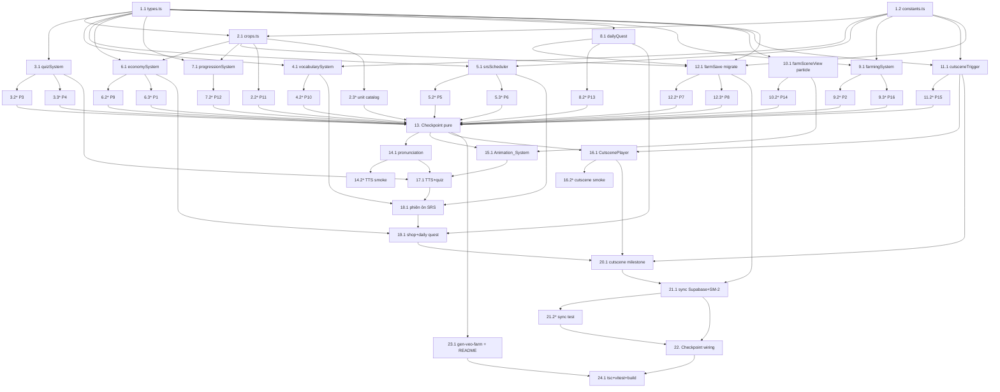

# Implementation Plan: English Farm Upgrade

## Overview

Kế hoạch triển khai đợt nâng cấp game *English Farm* theo nguyên tắc **tái dùng kiến trúc hiện có** và **logic thuần trước, lớp impure/tích hợp sau**. Thứ tự:

1. Mở rộng nền tảng dữ liệu thuần (`types.ts`, `constants.ts`, `data/crops.ts`).
2. Mở rộng / thêm mới các pure system (`quizSystem`, `vocabularySystem`, `srsScheduler` MỚI, `economySystem` MỚI, `progressionSystem`, `dailyQuest` MỚI, `farmingSystem`, `farmSceneView`, `cutsceneTrigger` MỚI, `farmSave` migrate v1→v2) — mỗi phần kèm property-based test (fast-check + Vitest, ≥100 iteration).
3. Lớp impure / trình duyệt (`pronunciation` Web Speech, `Animation_System` trong `createFarmScene`, `Cutscene_System` video offline + fallback).
4. Wiring vào `page.tsx` (TTS, quiz nhiều dạng, phiên ôn SRS, shop mua/bán, daily quest, cutscene milestone) và đồng bộ Supabase + SM-2.
5. `Asset_Pipeline` (script Veo offline + README) và kiểm thử cuối cùng.

Ngôn ngữ triển khai: **TypeScript** (theo đúng codebase hiện tại). Tất cả tên file/hàm/type giữ tiếng Anh.

Quy ước test PBT: mỗi test gắn comment `// Feature: english-farm-upgrade, Property N: <tên>`, chạy `fc.assert(fc.property(...), { numRuns: 100 })`.

## Tasks

- [x] 1. Mở rộng nền tảng kiểu dữ liệu và hằng số (tương thích ngược)
  - [x] 1.1 Mở rộng `types.ts`
    - Thêm `CropTheme`, `UnlockCondition`; mở rộng `CropType` (`seedCost?`, `unlock?`, `theme?`)
    - Mở rộng `CollectedWord` (`timesCorrect`, `nextReviewDay`)
    - Mở rộng `FarmState` (`unlockedCropIds`, `dailyQuest`); thêm `QuizMode`, `DailyQuest`, `QuestGoal`
    - File sửa: `src/game/farm/types.ts`
    - _Requirements: 1.1, 3.1, 8.4, 8.5_
    - _Properties: 5, 7, 10, 11, 13_
  - [x] 1.2 Mở rộng `constants.ts`
    - Bump `SCHEMA_VERSION = 2`; thêm `SRS_INTERVALS`, `MAX_CONCURRENT_PARTICLES`, `MAX_CONCURRENT_PARTICLES_MOBILE`, `BIG_HARVEST_THRESHOLD`, `MASTERED_THRESHOLD = 4`
    - File sửa: `src/game/farm/constants.ts`
    - _Requirements: 3.4, 6.7, 7.1, 9.2_
    - _Properties: 2, 5, 10_

- [x] 2. Mở rộng Crop_Catalog (>6 loại + mở khóa)
  - [x] 2.1 Mở rộng danh mục và helper mở khóa
    - Thêm các loại cây mới (`eggplant`, `cabbage`, `watermelon`, `pineapple`, `broccoli`...) kèm `level`, `growthDays`, `sellValue`, `seedKey`, `spriteKey`, `seedCost`, `unlock`, `theme`
    - Thêm `isCropUnlocked(crop, level, coins)` và `getUnlockedCrops(level, coins)`
    - File sửa: `src/game/farm/data/crops.ts`
    - _Requirements: 1.1, 5.1, 5.2, 8.4_
    - _Properties: 11_
  - [ ]* 2.2 Viết property test cho điều kiện mở khóa
    - **Property 11: Mở khóa theo điều kiện** (`isCropUnlocked` đúng khi và chỉ khi thỏa mọi điều kiện; cây không điều kiện luôn mở)
    - File tạo: `src/game/farm/data/crops.pbt.test.ts`
    - **Validates: Requirements 5.2, 8.4**
  - [ ]* 2.3 Viết unit test catalog tĩnh
    - Kiểm tra `CROPS.length > 6`, `id` duy nhất, `growthDays > 0`, `sellValue > 0`, `spriteKey` hợp lệ
    - File sửa: `src/game/farm/data/crops.test.ts`
    - _Requirements: 1.1, 5.1, 5.4_

- [x] 3. Mở rộng Quiz_System nhiều dạng
  - [x] 3.1 Thêm `QuizMode` và chuẩn hóa chấm điểm
    - Mở rộng `buildQuizForWord(bank, answer, mode)` cho `meaning`/`listen` (4 lựa chọn duy nhất, luôn chứa `en`, top-up `DEFAULT_WORD_BANK`) và `spelling` (`choices = []`)
    - Mở rộng `gradeQuiz(quiz, choice)`: chuẩn hóa trim + case-insensitive cho `spelling`, trả `correct=false` khi `choice` null/rỗng, luôn trả `correctAnswer = quiz.en`
    - File sửa: `src/game/farm/systems/quizSystem.ts`
    - _Requirements: 2.1, 2.2, 2.3, 2.4, 2.5, 2.6, 2.7, 2.8_
    - _Properties: 3, 4_
  - [ ]* 3.2 Viết property test cho quiz hợp lệ
    - **Property 3: Quiz luôn hợp lệ** (đúng 4 lựa chọn duy nhất chứa `en` cho meaning/listen; `choices` rỗng cho spelling; mang đúng `mode`)
    - File tạo: `src/game/farm/systems/quizSystem.pbt.test.ts`
    - **Validates: Requirements 2.1, 2.2, 2.3, 2.8**
  - [ ]* 3.3 Viết property test cho chấm điểm chuẩn hóa
    - **Property 4: Chấm quiz chuẩn hóa và an toàn** (spelling khớp sau trim+lowercase; meaning/listen khớp `en`; null/rỗng → false; `correctAnswer === quiz.en`)
    - File sửa: `src/game/farm/systems/quizSystem.pbt.test.ts`
    - **Validates: Requirements 2.4, 2.5, 2.6, 2.7**

- [x] 4. Mở rộng Vocabulary_System (lịch ôn + đếm từ thuộc)
  - [x] 4.1 Thêm field lịch ôn và `countMastered`
    - Bổ sung default `timesCorrect`/`nextReviewDay` khi `collectWord`; thêm `countMastered(words)` đếm `mastery >= MASTERED_THRESHOLD`
    - File sửa: `src/game/farm/systems/vocabularySystem.ts`
    - _Requirements: 3.1, 3.4_
    - _Properties: 10_
  - [ ]* 4.2 Viết property test cho đếm từ đã thuộc
    - **Property 10: Đếm từ đã thuộc** (`countMastered` = số phần tử `mastery >= 4`)
    - File tạo: `src/game/farm/systems/vocabularySystem.pbt.test.ts`
    - **Validates: Requirements 3.4**

- [x] 5. Tạo SRS_Scheduler thuần (THÊM MỚI)
  - [x] 5.1 Triển khai `srsScheduler.ts`
    - `pickDueWords(words, currentDay, limit)`: ưu tiên từ đến hạn, sort mastery thấp trước, fallback từ sắp đến hạn khi không có từ đến hạn
    - `reviewWord(words, en, correct, currentDay)`: cập nhật `timesSeen`/`timesCorrect`/`mastery` (clamp 0..5) + `nextReviewDay` theo `SRS_INTERVALS` (đúng → không giảm interval, sai → reset nhỏ nhất); trả mảng MỚI
    - File tạo: `src/game/farm/systems/srsScheduler.ts`
    - _Requirements: 3.1, 3.2, 3.3, 3.7_
    - _Properties: 5, 6_
  - [ ]* 5.2 Viết property test cho lập lịch SRS đơn điệu
    - **Property 5: Lập lịch SRS đơn điệu** (đúng → interval không giảm + `timesCorrect` tăng; sai → reset; `timesSeen` +1; `mastery` ∈ 0..5)
    - File tạo: `src/game/farm/systems/srsScheduler.pbt.test.ts`
    - **Validates: Requirements 3.1, 3.3**
  - [ ]* 5.3 Viết property test cho chọn từ ôn ưu tiên đến hạn
    - **Property 6: Chọn từ ôn ưu tiên đến hạn** (chỉ chọn từ đến hạn + sort mastery thấp trước khi có từ đến hạn; không rỗng khi danh sách không rỗng)
    - File sửa: `src/game/farm/systems/srsScheduler.pbt.test.ts`
    - **Validates: Requirements 3.2, 3.7**

- [x] 6. Tạo Economy_System thuần (THÊM MỚI)
  - [x] 6.1 Triển khai `economySystem.ts`
    - `sellCrop(state, cropId)`: `removeItem` 1 nông sản + `coins += sellValue`; từ chối khi không có nông sản/cây không hợp lệ
    - `buySeed(state, cropId)`: kiểm tra `isCropUnlocked` + đủ xu; `coins -= seedCost` (luôn >= 0) + `addItem` hạt; từ chối khi chưa mở khóa/thiếu xu
    - Tái dùng `inventorySystem.addItem/removeItem` và `getCropById`/`isCropUnlocked`
    - File tạo: `src/game/farm/systems/economySystem.ts`
    - _Requirements: 4.8, 8.1, 8.2_
    - _Properties: 1, 9_
  - [ ]* 6.2 Viết property test cho bán nông sản
    - **Property 9: Bán nông sản nhất quán** (có nông sản → qty −1, coins +`sellValue`; không có → `ok:false`, giữ nguyên)
    - File tạo: `src/game/farm/systems/economySystem.pbt.test.ts`
    - **Validates: Requirements 4.8**
  - [ ]* 6.3 Viết property test cho bất biến xu không âm
    - **Property 1: Xu không âm qua mọi giao dịch** (chuỗi `sellCrop`/`buySeed`/`addXp` ngẫu nhiên → `coins >= 0` sau mỗi bước)
    - File sửa: `src/game/farm/systems/economySystem.pbt.test.ts`
    - **Validates: Requirements 8.1, 8.2**

- [x] 7. Mở rộng Progression_System (mở khóa + nhảy bậc)
  - [x] 7.1 Thêm `newlyUnlockedCrops`
    - Giữ nguyên `addXp`/`xpForLevel`; thêm `newlyUnlockedCrops(prevLevel, nextLevel, coins)` trả các `cropId` vừa mở khóa
    - File sửa: `src/game/farm/systems/progressionSystem.ts`
    - _Requirements: 8.3, 8.4_
    - _Properties: 12_
  - [ ]* 7.2 Viết property test cho lên cấp nhảy bậc
    - **Property 12: Lên cấp nhảy bậc đúng** (sau `addXp` cấp tăng đúng số bậc tổng XP cho phép; XP dư < ngưỡng cấp kế; cấp >= 1)
    - File sửa: `src/game/farm/systems/progressionSystem.test.ts`
    - **Validates: Requirements 8.3**

- [x] 8. Tạo Daily Quest thuần (THÊM MỚI)
  - [x] 8.1 Triển khai `dailyQuest.ts`
    - `rollDailyQuest(day)` (deterministic theo seed = day), `trackQuest(q, goal, amount)` (clamp 0..target), `claimQuest(q)` (chỉ thưởng khi đạt target và chưa claim)
    - File tạo: `src/game/farm/systems/dailyQuest.ts`
    - _Requirements: 8.5_
    - _Properties: 13_
  - [ ]* 8.2 Viết property test cho daily quest
    - **Property 13: Daily quest đo được và thưởng đúng một lần** (`progress` clamp 0..target; `claimQuest` chỉ thưởng một lần khi đạt target)
    - File tạo: `src/game/farm/systems/dailyQuest.pbt.test.ts`
    - **Validates: Requirements 8.5**

- [ ] 9. Củng cố Farm_System (advanceDay + không ném lỗi)
  - [x] 9.1 Rà soát/điều chỉnh `farmingSystem.ts`
    - Đảm bảo `advanceDay` tăng stage cây được tưới `min(stage+1, GROWTH_STAGE_MAX)`, giữ nguyên cây không tưới, reset `wateredToday=false` cho mọi cây
    - Đảm bảo `till`/`plant`/`water`/`harvest` không ném lỗi, trả `{ ok, reason, state }` và giữ nguyên state khi `ok:false`
    - File sửa: `src/game/farm/systems/farmingSystem.ts`
    - _Requirements: 4.3, 4.4, 4.5, 4.7, 9.5_
    - _Properties: 2, 16_
  - [ ]* 9.2 Viết property test cho tiến trình cây theo ngày
    - **Property 2: Tiến trình cây theo ngày** (cây tưới `stage'=min(stage+1,MAX)`; cây không tưới giữ nguyên; `wateredToday` về false; `stage ∈ 0..MAX`)
    - File tạo: `src/game/farm/systems/farmingSystem.pbt.test.ts`
    - **Validates: Requirements 4.4, 4.5**
  - [ ]* 9.3 Viết property test cho không ném lỗi
    - **Property 16: Farm_System không ném lỗi** (mọi thao tác với tham số bất kỳ không throw; `ok:false` giữ nguyên state)
    - File sửa: `src/game/farm/systems/farmingSystem.pbt.test.ts`
    - **Validates: Requirements 4.3, 4.7, 9.5**

- [x] 10. Helper particle thuần trong farmSceneView
  - [x] 10.1 Thêm `resolveParticleKind`
    - `resolveParticleKind(tilled, watered)` ưu tiên `'soil'` khi cày, `'water'` khi chỉ tưới, `null` khi không có thao tác
    - File sửa: `src/game/farm/scene/farmSceneView.ts`
    - _Requirements: 6.5_
    - _Properties: 14_
  - [ ]* 10.2 Viết property test cho ưu tiên particle cày
    - **Property 14: Ưu tiên particle cày khi trùng**
    - File tạo: `src/game/farm/scene/farmSceneView.pbt.test.ts`
    - **Validates: Requirements 6.5**

- [x] 11. Bộ kích hoạt cutscene thuần (THÊM MỚI)
  - [x] 11.1 Triển khai `cutsceneTrigger.ts`
    - `resolveCutscene(event)` theo thứ tự ưu tiên: lên cấp → đổi mùa → thu hoạch lớn (`>= BIG_HARVEST_THRESHOLD`); `null` khi không đạt cột mốc
    - File tạo: `src/game/farm/scene/cutscene/cutsceneTrigger.ts`
    - _Requirements: 7.1_
    - _Properties: 15_
  - [ ]* 11.2 Viết property test cho chọn cutscene
    - **Property 15: Chọn cutscene theo cột mốc**
    - File tạo: `src/game/farm/scene/cutscene/cutsceneTrigger.pbt.test.ts`
    - **Validates: Requirements 7.1**

- [x] 12. Mở rộng Save_System (migrate v1→v2)
  - [x] 12.1 Cập nhật `farmSave.ts`
    - `createInitialFarmState` khởi tạo v2 (`unlockedCropIds`, `dailyQuest`, `CollectedWord` mới); `serializeFarm`/`deserializeFarm` cho v2
    - `deserializeFarm`: nhận v2 hợp lệ; `migrateV1toV2` điền default cho dữ liệu v1; mọi trường hợp khác (rác/null/sai schema/JSON hỏng) → `createInitialFarmState()`, không throw
    - File sửa: `src/game/farm/save/farmSave.ts`
    - _Requirements: 9.1, 9.2_
    - _Properties: 7, 8_
  - [ ]* 12.2 Viết property test cho round-trip lưu/khôi phục
    - **Property 7: Round-trip lưu/khôi phục** (`deserializeFarm(serializeFarm(state)) ≡ state` cho v2)
    - File tạo: `src/game/farm/save/farmSave.pbt.test.ts`
    - **Validates: Requirements 9.1**
  - [ ]* 12.3 Viết property test cho khôi phục an toàn khi dữ liệu hỏng
    - **Property 8: Khôi phục an toàn khi dữ liệu hỏng** (input bất kỳ → `FarmState` hợp lệ, không throw)
    - File sửa: `src/game/farm/save/farmSave.pbt.test.ts`
    - **Validates: Requirements 9.2**

- [ ] 13. Checkpoint - Lớp pure hoàn chỉnh
  - Ensure all tests pass, ask the user if questions arise.

- [ ] 14. Pronunciation_System (Web Speech API, impure)
  - [x] 14.1 Triển khai `lib/pronunciation.ts`
    - `isSpeechSupported()`, `pickEnglishVoice()` (chọn voice `en-*`), `speak(text, opts)` bọc try/catch, no-op + trả `false` khi không hỗ trợ
    - File tạo: `src/lib/pronunciation.ts`
    - _Requirements: 1.2, 1.4, 1.5_
  - [ ]* 14.2 Viết smoke test cho TTS
    - Mock `window.speechSynthesis`: xác nhận `speak` gọi đúng từ; trả `false` khi không hỗ trợ; `pickEnglishVoice` chọn `en-*`
    - File tạo: `src/lib/pronunciation.test.ts`
    - _Requirements: 1.2, 1.4, 1.5_

- [x] 15. Animation_System mở rộng (Phaser scene)
  - [x] 15.1 Nâng cấp hiệu ứng trong `createFarmScene.ts`
    - Đung đưa theo gió cho mọi cây `planted`; lớn mượt (tween scale `Back.easeOut`); nảy mầm khi gieo; lấp lánh khi chín
    - Particle cày/tưới dùng `resolveParticleKind`; phản hồi quiz đúng/sai; giới hạn particle theo `MAX_CONCURRENT_PARTICLES`/`_MOBILE`
    - Bọc `loaderror` texture → fallback iso/emoji (không vỡ render)
    - File sửa: `src/game/farm/scene/createFarmScene.ts`
    - _Requirements: 5.3, 6.1, 6.2, 6.3, 6.4, 6.5, 6.6, 6.7, 9.4_

- [x] 16. Cutscene_System overlay (React, never throws)
  - [x] 16.1 Triển khai `CutscenePlayer.tsx`
    - `<video src="/games/english-farm/cutscenes/<id>.mp4" autoPlay playsInline />`; `onError`/video thiếu → fallback CSS/particle; nút "Bỏ qua" (skip) → `onComplete`; fallback lỗi → `onComplete()` ngay
    - Không import `@google/genai` (chỉ phát asset cục bộ)
    - File tạo: `src/game/farm/scene/cutscene/CutscenePlayer.tsx`
    - _Requirements: 7.2, 7.3, 7.4_
  - [ ]* 16.2 Viết smoke test cho cutscene
    - Xác nhận chỉ dùng `<video src=local>`; `onError` → fallback; skip → `onComplete`
    - File tạo: `src/game/farm/scene/cutscene/CutscenePlayer.test.tsx`
    - _Requirements: 7.2, 7.3, 7.4_

- [x] 17. Wiring học tập vào page.tsx (TTS + quiz nhiều dạng)
  - [x] 17.1 Gắn TTS và quiz nhiều dạng
    - Phát âm `en` khi chọn hạt để gieo (Req 1.2) và khi chạm cây trồng (hiển thị `en`/`vi` + nút loa, disable khi `!isSpeechSupported()`) (Req 1.3, 1.4)
    - Mở quiz `meaning`/`listen`/`spelling` khi thu hoạch, gọi `buildQuizForWord(mode)` + `gradeQuiz`, cộng XP theo `XP_PER_CORRECT` khi đúng
    - File sửa: `src/app/games/english-farm/page.tsx`
    - _Requirements: 1.2, 1.3, 1.4, 1.5, 2.1, 2.5, 2.6, 2.7_

- [x] 18. Wiring phiên ôn SRS vào page.tsx
  - [x] 18.1 Thêm UI phiên ôn từ
    - Dùng `pickDueWords` chọn từ đến hạn, `reviewWord` cập nhật sau mỗi câu; hiển thị số "từ đã thuộc" qua `countMastered`
    - File sửa: `src/app/games/english-farm/page.tsx`
    - _Requirements: 3.2, 3.3, 3.4, 3.7_

- [x] 19. Wiring shop và daily quest vào page.tsx
  - [x] 19.1 Thêm UI shop và daily quest
    - Shop mua hạt (`buySeed`) / bán nông sản (`sellCrop`); hiển thị daily quest (`rollDailyQuest`/`trackQuest`/`claimQuest`), cập nhật tiến độ theo sự kiện harvest/review/sell
    - File sửa: `src/app/games/english-farm/page.tsx`
    - _Requirements: 4.8, 8.1, 8.2, 8.5_

- [x] 20. Wiring cutscene milestone vào page.tsx
  - [x] 20.1 Gắn cutscene theo cột mốc
    - Sau harvest/level-up/đổi mùa gọi `resolveCutscene(event)`; nếu có id → mở `CutscenePlayer`; luôn cho game tiếp tục khi skip/lỗi
    - File sửa: `src/app/games/english-farm/page.tsx`
    - _Requirements: 7.1, 7.3, 7.4_

- [x] 21. Đồng bộ Supabase + SM-2 cho người chơi đăng nhập
  - [x] 21.1 Gắn lưu/đồng bộ tài khoản
    - Logged-in: `PUT` save `FarmState` lên Supabase, lỗi → fallback `localStorage`; guest → luôn `localStorage`
    - Khi ôn từ lúc logged-in: gọi `syncSavedWordToSRS({ word, meaningVi })` (fire-and-forget) trong `services/vocabulary.ts`; guest không gọi server
    - File sửa: `src/app/games/english-farm/page.tsx`, `src/game/farm/save/farmSave.ts`, `src/services/vocabulary.ts` (nếu cần helper)
    - _Requirements: 3.5, 3.6, 8.6, 8.7, 9.3_
  - [ ]* 21.2 Viết integration test (mock) cho đồng bộ
    - Mock `fetch`/`localStorage`: PUT khi logged-in, fallback localStorage khi lỗi, guest luôn localStorage; mock `syncSavedWordToSRS` gọi khi logged-in, không gọi khi guest
    - File tạo: `src/game/farm/save/farmSave.sync.test.ts`
    - _Requirements: 3.5, 3.6, 8.6, 8.7, 9.3_

- [x] 22. Checkpoint - Wiring hoàn chỉnh
  - Ensure all tests pass, ask the user if questions arise.

- [x] 23. Asset_Pipeline (script Veo offline + README)
  - [x] 23.1 Tạo script Veo offline và cập nhật README asset
    - Tạo `scripts/gen-veo-farm.mjs` theo pattern `scripts/gen-veo-evolve.mjs` (đọc key từ env/.env.local, ghi `<id>.mp4` + `manifest.json` vào `public/games/english-farm/cutscenes/`, KHÔNG gọi runtime trong game)
    - Cập nhật `public/games/english-farm/assets/README.md`: quy ước đặt tên (`<cropId>.png`, `<cropId>-1..-4.png`, `tile-*.png`, `cutscenes/<id>.mp4`) + prompt template Dreamina (rau củ) và Veo 3 (cutscene)
    - File tạo: `scripts/gen-veo-farm.mjs`; File sửa: `public/games/english-farm/assets/README.md`
    - _Requirements: 5.4, 5.5, 7.5_

- [x] 24. Kiểm thử và build cuối cùng
  - [x] 24.1 Chạy kiểm tra toàn diện và sửa lỗi
    - Chạy `npx tsc --noEmit`, `npx vitest run`, `npm run build`; sửa mọi lỗi type/test/build phát sinh
    - _Requirements: 9.1, 9.2, 9.5_

## Notes

- Tasks gắn hậu tố `*` là test (PBT/unit/integration/smoke) — tùy chọn, có thể bỏ qua cho MVP nhanh nhưng nên giữ để bảo đảm 16 property.
- Mỗi task tham chiếu `_Requirements:_` và `_Properties:_` để truy vết.
- 16 property của design được phủ qua các task: P1→6.3, P2→9.2, P3→3.2, P4→3.3, P5→5.2, P6→5.3, P7→12.2, P8→12.3, P9→6.2, P10→4.2, P11→2.2, P12→7.2, P13→8.2, P14→10.2, P15→11.2, P16→9.3.
- Lớp pure được hoàn thiện và test trước (task 1–12) rồi mới tới impure/tích hợp (14–21).
- Các task wiring (17–21) cùng sửa `page.tsx` nên phải thực hiện tuần tự (khác wave) để tránh xung đột file.
- Veo chỉ chạy offline (task 23); không yêu cầu chạy runtime trong game.

## Task Dependency Graph

Các wave thực thi song song (task cùng wave độc lập, không ghi cùng file). Các task wiring 17.1→21.1 cùng sửa `page.tsx` nên tách thành các wave khác nhau.

```json
{
  "waves": [
    { "id": 0, "tasks": ["1.1", "1.2"] },
    { "id": 1, "tasks": ["2.1", "3.1", "4.1", "9.1", "10.1", "11.1"] },
    { "id": 2, "tasks": ["5.1", "6.1", "7.1", "8.1"] },
    { "id": 3, "tasks": ["12.1"] },
    { "id": 4, "tasks": ["2.2", "2.3", "3.2", "3.3", "4.2", "5.2", "5.3", "6.2", "6.3", "7.2", "8.2", "9.2", "9.3", "10.2", "11.2", "12.2", "12.3"] },
    { "id": 5, "tasks": ["14.1", "16.1"] },
    { "id": 6, "tasks": ["14.2", "15.1", "16.2"] },
    { "id": 7, "tasks": ["17.1", "23.1"] },
    { "id": 8, "tasks": ["18.1"] },
    { "id": 9, "tasks": ["19.1"] },
    { "id": 10, "tasks": ["20.1"] },
    { "id": 11, "tasks": ["21.1"] },
    { "id": 12, "tasks": ["21.2"] },
    { "id": 13, "tasks": ["24.1"] }
  ]
}
```

Sơ đồ trực quan (thứ tự + parallelism):


