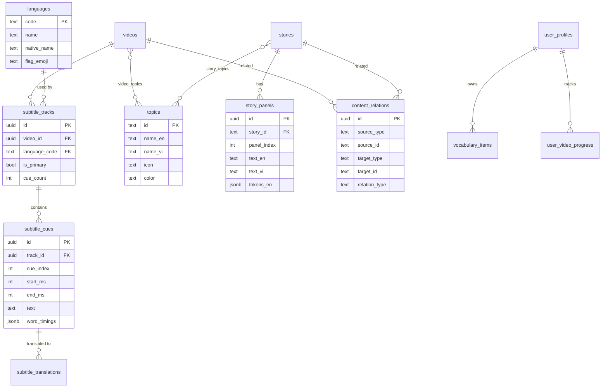

# 📊 ComicLingua Kids - Database Schema & ERD

## � Current Status (Jan 2026)

| Table | Rows | Status |
|-------|------|--------|
| `videos` | 3 | ✅ OK (có 2 stuck uploading) |
| `video_subtitles` | 0 | ⚠️ Cũ, nên dùng subtitle_tracks/cues |
| `stories` | 0 | ⚠️ Cần thêm content |
| `topics` | 15 | ✅ Đã normalize |
| `languages` | 5 | ✅ EN, VI, JA, KO, ZH |
| `subtitle_tracks` | 0 | ✅ Ready |
| `subtitle_cues` | 0 | ✅ Ready |
| `user_profiles` | 1 | ✅ OK |
| `user_progress` | 1 | ✅ OK |
| `vocabulary_items` | - | ❌ Cần chạy migration |
| `learning_sessions` | - | ❌ Cần chạy migration |
| `user_achievements` | - | ❌ Cần chạy migration |
| `daily_goals` | - | ❌ Cần chạy migration |

### 🔧 Migration Cần Chạy
```
supabase/migrations/009_fix_and_complete.sql
```

---

## 🔍 Phân Tích Chi Tiết

### ERD Diagram (Mermaid)

```mermaid
erDiagram
    %% Core Content
    videos ||--o{ video_subtitles : "has"
    videos ||--o{ user_video_progress : "tracked by"
    
    stories ||--o{ user_progress : "tracked in"
    
    %% User Management
    user_profiles ||--o| user_progress : "has"
    user_profiles ||--o{ user_video_progress : "has"
    user_profiles ||--o{ vocabulary_items : "owns"
    user_profiles ||--o{ learning_sessions : "logs"
    user_profiles ||--o{ user_achievements : "earns"
    user_profiles ||--o{ daily_goals : "sets"
    
    %% Admin
    admin_users ||--o{ admin_sessions : "has"
    
    videos {
        uuid id PK
        text title
        text title_vi
        text description
        text thumbnail_url
        text bunny_video_id UK
        text hls_url
        text dash_url
        int duration
        text level
        text[] topics
        text age_group
        text category
        text status
        timestamp deleted_at
    }
    
    video_subtitles {
        uuid id PK
        uuid video_id FK
        int cue_index
        float start_time
        float end_time
        text text_en
        text text_vi
    }
    
    stories {
        text id PK
        text title_en
        text title_vi
        text level
        text[] topics
        text cover_image
        int estimated_minutes
        jsonb panels
        jsonb vocabulary
        jsonb games
    }
    
    user_profiles {
        uuid id PK
        uuid auth_id UK
        text device_id UK
        text email
        text name
        text avatar_url
        text account_type
        text role
    }
    
    user_progress {
        uuid id PK
        uuid user_profile_id FK UK
        int total_stars
        int current_streak
        text[] saved_words
        jsonb stories_progress
        jsonb videos_progress
    }
    
    vocabulary_items {
        uuid id PK
        uuid user_profile_id FK
        text word
        text meaning_vi
        text meaning_en
        float ease_factor
        int interval_days
        date next_review_date
        int mastery_level
    }
```

---

## ⚠️ Vấn Đề Hiện Tại

### 1. **Video Subtitles - Thiếu Multi-language Support**
```sql
-- Hiện tại: Chỉ 2 ngôn ngữ fixed
text_en TEXT NOT NULL,
text_vi TEXT NOT NULL
```
**Vấn đề**: Không mở rộng được cho ngôn ngữ khác (Japanese, Korean, Chinese...)

### 2. **Stories - JSONB quá lớn**
```sql
panels JSONB NOT NULL DEFAULT '[]',
vocabulary JSONB NOT NULL DEFAULT '[]',
games JSONB NOT NULL DEFAULT '{}'
```
**Vấn đề**: 
- Không index được từng panel
- Query chậm khi story lớn
- Khó update 1 panel riêng lẻ

### 3. **Thiếu bảng Categories/Topics**
- Topics là `TEXT[]` → Không validate, có thể duplicate
- Không có metadata cho topic (icon, color, description)

### 4. **Video-Story Relationship Missing**
- Video và Story không liên kết → Không thể recommend "Xem video liên quan đến truyện này"

### 5. **Subtitles Timing Precision**
- `start_time FLOAT` có thể bị precision issues
- Nên dùng `NUMERIC(10,3)` hoặc store milliseconds as INT

---

## ✅ Schema Tối Ưu Đề Xuất

### Migration 008: Enhanced Schema

```sql
-- ============================================
-- 008_ENHANCED_SCHEMA.sql
-- Tối ưu database cho bilingual subtitles & scalability
-- ============================================

-- ============================================
-- 1. TOPICS/CATEGORIES TABLE (Normalize topics)
-- ============================================

CREATE TABLE IF NOT EXISTS topics (
  id TEXT PRIMARY KEY, -- 'animals', 'food', etc.
  name_en TEXT NOT NULL,
  name_vi TEXT NOT NULL,
  icon TEXT, -- emoji: '🐾', '🍕'
  color TEXT, -- hex color for UI
  description_en TEXT,
  description_vi TEXT,
  sort_order INTEGER DEFAULT 0,
  is_active BOOLEAN DEFAULT true,
  created_at TIMESTAMPTZ DEFAULT NOW()
);

-- Seed default topics
INSERT INTO topics (id, name_en, name_vi, icon, color, sort_order) VALUES
  ('animals', 'Animals', 'Động vật', '🐾', '#f97316', 1),
  ('food', 'Food', 'Đồ ăn', '🍕', '#ec4899', 2),
  ('nature', 'Nature', 'Thiên nhiên', '🌿', '#22c55e', 3),
  ('family', 'Family', 'Gia đình', '👨‍👩‍👧', '#ec4899', 4),
  ('school', 'School', 'Trường học', '📚', '#3b82f6', 5),
  ('adventure', 'Adventure', 'Phiêu lưu', '🚀', '#a855f7', 6),
  ('friendship', 'Friendship', 'Tình bạn', '💕', '#ec4899', 7),
  ('science', 'Science', 'Khoa học', '🔬', '#3b82f6', 8),
  ('daily-life', 'Daily Life', 'Sinh hoạt', '☀️', '#f97316', 9),
  ('history', 'History', 'Lịch sử', '🏛️', '#eab308', 10)
ON CONFLICT (id) DO NOTHING;

-- ============================================
-- 2. LANGUAGES TABLE (Multi-language support)
-- ============================================

CREATE TABLE IF NOT EXISTS languages (
  code TEXT PRIMARY KEY, -- 'en', 'vi', 'ja', 'ko'
  name TEXT NOT NULL,
  native_name TEXT NOT NULL, -- 'English', 'Tiếng Việt'
  flag_emoji TEXT,
  is_active BOOLEAN DEFAULT true,
  sort_order INTEGER DEFAULT 0
);

INSERT INTO languages (code, name, native_name, flag_emoji, sort_order) VALUES
  ('en', 'English', 'English', '🇬🇧', 1),
  ('vi', 'Vietnamese', 'Tiếng Việt', '🇻🇳', 2),
  ('ja', 'Japanese', '日本語', '🇯🇵', 3),
  ('ko', 'Korean', '한국어', '🇰🇷', 4),
  ('zh', 'Chinese', '中文', '🇨🇳', 5)
ON CONFLICT (code) DO NOTHING;

-- ============================================
-- 3. SUBTITLE_TRACKS TABLE (Multi-language subtitles)
-- ============================================

-- Each video can have multiple subtitle tracks
CREATE TABLE IF NOT EXISTS subtitle_tracks (
  id UUID PRIMARY KEY DEFAULT gen_random_uuid(),
  video_id UUID NOT NULL REFERENCES videos(id) ON DELETE CASCADE,
  language_code TEXT NOT NULL REFERENCES languages(code),
  
  -- Track metadata
  label TEXT, -- "English", "Vietnamese", "Auto-generated"
  is_primary BOOLEAN DEFAULT false, -- Primary subtitle for this video
  is_auto_generated BOOLEAN DEFAULT false, -- AI generated
  
  -- Stats
  cue_count INTEGER DEFAULT 0,
  
  created_at TIMESTAMPTZ DEFAULT NOW(),
  updated_at TIMESTAMPTZ DEFAULT NOW(),
  
  UNIQUE(video_id, language_code)
);

CREATE INDEX IF NOT EXISTS idx_subtitle_tracks_video ON subtitle_tracks(video_id);

-- ============================================
-- 4. SUBTITLE_CUES TABLE (Individual subtitle lines)
-- ============================================

-- Replace video_subtitles with more flexible structure
CREATE TABLE IF NOT EXISTS subtitle_cues (
  id UUID PRIMARY KEY DEFAULT gen_random_uuid(),
  track_id UUID NOT NULL REFERENCES subtitle_tracks(id) ON DELETE CASCADE,
  
  -- Timing (stored as milliseconds for precision)
  cue_index INTEGER NOT NULL,
  start_ms INTEGER NOT NULL, -- milliseconds
  end_ms INTEGER NOT NULL,
  
  -- Content
  text TEXT NOT NULL,
  
  -- Word-level timing (for karaoke effect)
  word_timings JSONB, -- [{"word": "Hello", "start_ms": 1000, "end_ms": 1500}, ...]
  
  created_at TIMESTAMPTZ DEFAULT NOW(),
  
  UNIQUE(track_id, cue_index)
);

CREATE INDEX IF NOT EXISTS idx_subtitle_cues_track ON subtitle_cues(track_id);
CREATE INDEX IF NOT EXISTS idx_subtitle_cues_timing ON subtitle_cues(track_id, start_ms);

-- ============================================
-- 5. SUBTITLE_TRANSLATIONS TABLE (Link EN ↔ VI cues)
-- ============================================

-- Link subtitle cues across languages for bilingual display
CREATE TABLE IF NOT EXISTS subtitle_translations (
  id UUID PRIMARY KEY DEFAULT gen_random_uuid(),
  source_cue_id UUID NOT NULL REFERENCES subtitle_cues(id) ON DELETE CASCADE,
  target_cue_id UUID NOT NULL REFERENCES subtitle_cues(id) ON DELETE CASCADE,
  
  -- Translation quality
  translation_type TEXT CHECK (translation_type IN ('human', 'ai', 'community')),
  confidence_score FLOAT, -- 0.0 - 1.0 for AI translations
  
  created_at TIMESTAMPTZ DEFAULT NOW(),
  
  UNIQUE(source_cue_id, target_cue_id)
);

-- ============================================
-- 6. VIDEO_TOPICS JUNCTION TABLE
-- ============================================

-- Replace topics TEXT[] with proper junction table
CREATE TABLE IF NOT EXISTS video_topics (
  video_id UUID NOT NULL REFERENCES videos(id) ON DELETE CASCADE,
  topic_id TEXT NOT NULL REFERENCES topics(id) ON DELETE CASCADE,
  PRIMARY KEY (video_id, topic_id)
);

CREATE TABLE IF NOT EXISTS story_topics (
  story_id TEXT NOT NULL REFERENCES stories(id) ON DELETE CASCADE,
  topic_id TEXT NOT NULL REFERENCES topics(id) ON DELETE CASCADE,
  PRIMARY KEY (story_id, topic_id)
);

-- ============================================
-- 7. STORY_PANELS TABLE (Normalize panels)
-- ============================================

CREATE TABLE IF NOT EXISTS story_panels (
  id UUID PRIMARY KEY DEFAULT gen_random_uuid(),
  story_id TEXT NOT NULL REFERENCES stories(id) ON DELETE CASCADE,
  
  panel_index INTEGER NOT NULL,
  image_url TEXT,
  image_alt TEXT,
  
  -- Text content
  text_en TEXT NOT NULL,
  text_vi TEXT NOT NULL,
  
  -- Parsed tokens (for interactive learning)
  tokens_en JSONB, -- [{"display": "Hello", "lemma": "hello", "pos": "intj"}]
  tokens_vi JSONB,
  
  -- Audio (TTS or recorded)
  audio_url_en TEXT,
  audio_url_vi TEXT,
  
  created_at TIMESTAMPTZ DEFAULT NOW(),
  updated_at TIMESTAMPTZ DEFAULT NOW(),
  
  UNIQUE(story_id, panel_index)
);

CREATE INDEX IF NOT EXISTS idx_story_panels_story ON story_panels(story_id);

-- ============================================
-- 8. CONTENT_RELATIONS (Video ↔ Story links)
-- ============================================

CREATE TABLE IF NOT EXISTS content_relations (
  id UUID PRIMARY KEY DEFAULT gen_random_uuid(),
  
  -- Source content
  source_type TEXT NOT NULL CHECK (source_type IN ('video', 'story')),
  source_id TEXT NOT NULL,
  
  -- Related content
  target_type TEXT NOT NULL CHECK (target_type IN ('video', 'story')),
  target_id TEXT NOT NULL,
  
  -- Relation metadata
  relation_type TEXT CHECK (relation_type IN ('sequel', 'prequel', 'related', 'same_topic', 'same_series')),
  sort_order INTEGER DEFAULT 0,
  
  created_at TIMESTAMPTZ DEFAULT NOW(),
  
  UNIQUE(source_type, source_id, target_type, target_id)
);

-- ============================================
-- 9. ADD COLUMNS TO EXISTING TABLES
-- ============================================

-- Add primary language to videos
ALTER TABLE videos 
ADD COLUMN IF NOT EXISTS primary_language TEXT DEFAULT 'en' REFERENCES languages(code),
ADD COLUMN IF NOT EXISTS difficulty_score INTEGER CHECK (difficulty_score BETWEEN 1 AND 10);

-- Add series/collection support
ALTER TABLE videos
ADD COLUMN IF NOT EXISTS series_id TEXT,
ADD COLUMN IF NOT EXISTS episode_number INTEGER;

ALTER TABLE stories
ADD COLUMN IF NOT EXISTS series_id TEXT,
ADD COLUMN IF NOT EXISTS episode_number INTEGER;

-- ============================================
-- 10. HELPER VIEWS
-- ============================================

-- View: Videos with subtitle counts
CREATE OR REPLACE VIEW videos_with_subtitles AS
SELECT 
  v.*,
  COALESCE(st.subtitle_count, 0) as subtitle_track_count,
  COALESCE(st.languages, '{}') as available_languages
FROM videos v
LEFT JOIN (
  SELECT 
    video_id,
    COUNT(*) as subtitle_count,
    ARRAY_AGG(language_code) as languages
  FROM subtitle_tracks
  GROUP BY video_id
) st ON v.id = st.video_id;

-- View: Bilingual subtitle pairs
CREATE OR REPLACE VIEW bilingual_subtitles AS
SELECT 
  v.id as video_id,
  v.title,
  en_cue.cue_index,
  en_cue.start_ms,
  en_cue.end_ms,
  en_cue.text as text_en,
  vi_cue.text as text_vi
FROM videos v
JOIN subtitle_tracks en_track ON v.id = en_track.video_id AND en_track.language_code = 'en'
JOIN subtitle_cues en_cue ON en_track.id = en_cue.track_id
LEFT JOIN subtitle_translations st ON en_cue.id = st.source_cue_id
LEFT JOIN subtitle_cues vi_cue ON st.target_cue_id = vi_cue.id;

-- ============================================
-- 11. ENABLE RLS
-- ============================================

ALTER TABLE topics ENABLE ROW LEVEL SECURITY;
ALTER TABLE languages ENABLE ROW LEVEL SECURITY;
ALTER TABLE subtitle_tracks ENABLE ROW LEVEL SECURITY;
ALTER TABLE subtitle_cues ENABLE ROW LEVEL SECURITY;
ALTER TABLE subtitle_translations ENABLE ROW LEVEL SECURITY;
ALTER TABLE video_topics ENABLE ROW LEVEL SECURITY;
ALTER TABLE story_topics ENABLE ROW LEVEL SECURITY;
ALTER TABLE story_panels ENABLE ROW LEVEL SECURITY;
ALTER TABLE content_relations ENABLE ROW LEVEL SECURITY;

-- Public read for content tables
CREATE POLICY "Public read" ON topics FOR SELECT USING (true);
CREATE POLICY "Public read" ON languages FOR SELECT USING (true);
CREATE POLICY "Public read" ON subtitle_tracks FOR SELECT USING (true);
CREATE POLICY "Public read" ON subtitle_cues FOR SELECT USING (true);
CREATE POLICY "Public read" ON subtitle_translations FOR SELECT USING (true);
CREATE POLICY "Public read" ON video_topics FOR SELECT USING (true);
CREATE POLICY "Public read" ON story_topics FOR SELECT USING (true);
CREATE POLICY "Public read" ON story_panels FOR SELECT USING (true);
CREATE POLICY "Public read" ON content_relations FOR SELECT USING (true);

-- Service role write
CREATE POLICY "Service write" ON topics FOR ALL USING (auth.role() = 'service_role');
CREATE POLICY "Service write" ON languages FOR ALL USING (auth.role() = 'service_role');
CREATE POLICY "Service write" ON subtitle_tracks FOR ALL USING (auth.role() = 'service_role');
CREATE POLICY "Service write" ON subtitle_cues FOR ALL USING (auth.role() = 'service_role');
CREATE POLICY "Service write" ON subtitle_translations FOR ALL USING (auth.role() = 'service_role');
CREATE POLICY "Service write" ON video_topics FOR ALL USING (auth.role() = 'service_role');
CREATE POLICY "Service write" ON story_topics FOR ALL USING (auth.role() = 'service_role');
CREATE POLICY "Service write" ON story_panels FOR ALL USING (auth.role() = 'service_role');
CREATE POLICY "Service write" ON content_relations FOR ALL USING (auth.role() = 'service_role');
```

---

## 📊 ERD Sau Khi Tối Ưu



---

## 🎯 Lợi Ích Của Schema Mới

| Cải tiến | Lợi ích |
|---------|---------|
| **Multi-language subtitles** | Thêm Japanese, Korean, Chinese dễ dàng |
| **Topics normalized** | Validate, có metadata, dễ quản lý |
| **Story panels normalized** | Query từng panel, index được |
| **Content relations** | Recommend video ↔ story liên quan |
| **Millisecond timing** | Chính xác hơn cho karaoke effect |
| **Word-level timing** | Highlight từng từ khi đọc |
| **Translation tracking** | Biết human vs AI translation |

---

## 📝 Migration Strategy

1. **Phase 1** (Backward compatible): Tạo tables mới, giữ tables cũ
2. **Phase 2**: Migrate data từ `video_subtitles` → `subtitle_tracks` + `subtitle_cues`
3. **Phase 3**: Migrate `stories.panels` JSONB → `story_panels` table
4. **Phase 4**: Update app code để dùng schema mới
5. **Phase 5**: Drop old columns/tables

---

## ⚡ Quick Fix Cho Hiện Tại

Nếu chưa muốn migrate lớn, có thể dùng workaround:

```sql
-- Thêm cột JSON cho multi-language subtitles
ALTER TABLE video_subtitles 
ADD COLUMN IF NOT EXISTS translations JSONB DEFAULT '{}';
-- Format: {"ja": "こんにちは", "ko": "안녕하세요", ...}

-- Thêm word-level timing
ALTER TABLE video_subtitles
ADD COLUMN IF NOT EXISTS word_timings JSONB;
-- Format: [{"word": "Hello", "start": 1.0, "end": 1.5}, ...]
```

Nhưng **khuyến nghị dùng schema mới** cho scalability dài hạn!
